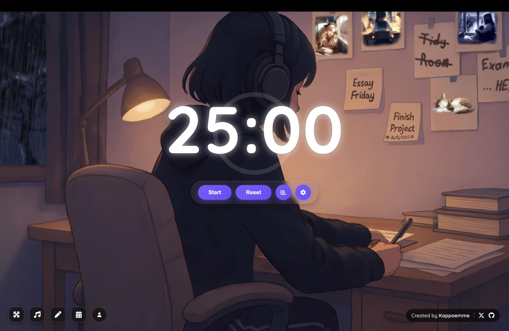

  
  <h1>VibeDesk</h1>
  
<strong>A calmer place to focus.</strong>

  
A browser-based workspace for focused sessions, music, ambient sound, notes, and tasks.

  

    <a href="https://www.vibedesk.online/"><strong>Open VibeDesk</strong></a>
    · <a href="https://www.vibedesk.online/about.html">About the project</a>
    · <a href="mailto:hello@vibedesk.online">Contact</a>
  

<em>The focus timer with one of VibeDesk's available scenes.</em>

## What is VibeDesk?

VibeDesk brings the tools for a focused work session into one tab. Set a Pomodoro timer, choose a scene, play a radio station or ambient sound, and keep your notes and tasks nearby. The app is [live at vibedesk.online](https://www.vibedesk.online/).

| Area | What you can do |
| --- | --- |
| Focus | Run a Pomodoro timer with adjustable session presets and a visual progress ring. |
| Atmosphere | Choose from animated and still scenes, radio stations, and ambient sounds such as rain, fire, ocean, and white noise. |
| Planning | Write notes and manage tasks alongside your focus session. |
| Progress | Review focus time, session history, weekly goals, and streaks. |
| Account | Sign in with Google or GitHub for account features backed by Firebase. |

Some data is saved in the browser. Account features use Firebase Authentication and Firestore; feature availability may depend on the current plan in the live app.

## Project and founder

VibeDesk is an independent project started in **November 2025** by **Francesco Mistero**, also known as **Kappaemme**, in Italy. It is **not yet registered as a company**. This repository contains the app's public source code; the [About page](https://www.vibedesk.online/about.html) connects the live product, founder, and contact address.

For project questions, write to **[hello@vibedesk.online](mailto:hello@vibedesk.online)** or open a [GitHub issue](https://github.com/Kappaemme-git/Vibedesk-2.0/issues).

## Run locally

The frontend uses **React 19** and **Vite 7**. It expects a Firebase project for authentication and Firestore. Configure Google and GitHub sign-in providers in that project if you want to test those flows locally.

1. Install dependencies:

   ~~~bash
   npm ci
   ~~~

2. Create a <code>.env.local</code> file in the repository root with your Firebase web app configuration:

   ~~~dotenv
   VITE_FIREBASE_API_KEY=your_firebase_api_key
   VITE_FIREBASE_AUTH_DOMAIN=your-project.firebaseapp.com
   VITE_FIREBASE_PROJECT_ID=your-project-id
   VITE_FIREBASE_STORAGE_BUCKET=your-project.firebasestorage.app
   VITE_FIREBASE_MESSAGING_SENDER_ID=your_sender_id
   VITE_FIREBASE_APP_ID=your_app_id
   VITE_FIREBASE_MEASUREMENT_ID=your_measurement_id
   ~~~

3. Start the development server:

   ~~~bash
   npm run dev
   ~~~

Open the local URL printed by Vite. Use <code>npm run build</code> for a production build, <code>npm run preview</code> to inspect that build, and <code>npm run lint</code> to run ESLint.

## Repository map

| Path | Purpose |
| --- | --- |
| [src/App.jsx](src/App.jsx) | Focus timer, scenes, audio controls, tasks, notes, and progress UI. |
| [src/lib/firebase.js](src/lib/firebase.js) | Firebase client configuration. |
| [public/](public/) | Images, video scenes, audio, app metadata, and the public About page. |
| [functions/](functions/) | Firebase Cloud Functions code used by the project. |
| [remotion/](remotion/) | Separate video/trailer project. |

---

Built by <a href="https://github.com/Kappaemme-git">Francesco Mistero (Kappaemme)</a> · <a href="https://www.vibedesk.online/">vibedesk.online</a>

